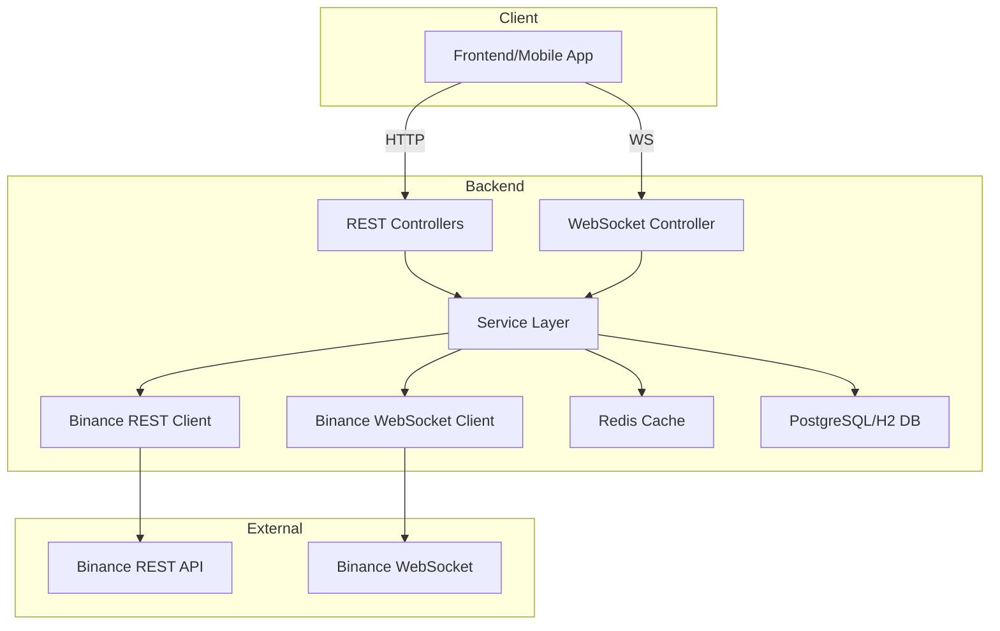

# Crypto Analysis Backend API - Implementation Plan

Backend API implementation for cryptocurrency analysis using Binance API integration with Spring Boot.

## Overview

Build a robust backend API that provides:

- **REST endpoints** for historical crypto data and symbol information
- **WebSocket streams** for real-time price updates
- **Hybrid caching** (Redis + Database) for optimal performance
- **Multi-symbol support** for crypto pairs

---

## Architecture



---

## Technology Stack

- **Framework**: Spring Boot 3.2.1 + Java 21
- **WebSocket**: Spring WebSocket + STOMP
- **HTTP Client**: Spring WebClient (reactive)
- **Cache**: Redis (hot data) + Caffeine (local cache)
- **Database**: PostgreSQL (production) or H2 (development)
- **Scheduling**: Spring @Scheduled
- **Serialization**: Jackson JSON

---

## Binance API Reference

### WebSocket Streams Explained

| Stream Type            | Format                      | Update Frequency  | Data Size                | Use Case                    |
| ---------------------- | --------------------------- | ----------------- | ------------------------ | --------------------------- |
| **Kline/Candlestick**  | `<symbol>@kline_<interval>` | Every 1-2 seconds | Medium                   | Real-time chart updates     |
| **Individual Ticker**  | `<symbol>@ticker`           | ~1 second         | Large (full stats)       | Single symbol detailed view |
| **All Market Tickers** | `!ticker@arr`               | ~1 second         | Very Large (all symbols) | ❌ Not recommended (heavy)  |
| **Mini Ticker**        | `!miniTicker@arr`           | ~1 second         | Medium (lightweight)     | ✅ Watchlist updates        |

**Recommendation:**

- Use `!miniTicker@arr` for watchlist (all symbols, lightweight)
- Use `<symbol>@ticker` when user selects a specific symbol
- Use `<symbol>@kline_<interval>` for chart updates

### REST API Endpoints

| Endpoint                   | Purpose                         | Response Data                      | When to Use            |
| -------------------------- | ------------------------------- | ---------------------------------- | ---------------------- |
| `GET /api/v3/exchangeInfo` | List all symbols, trading rules | Symbol metadata, status, precision | Startup, daily refresh |
| `GET /api/v3/klines`       | Historical candlestick data     | OHLCV array                        | Chart initialization   |
| `GET /api/v3/ticker/24hr`  | 24-hour statistics              | Price change, volume, high, low    | Dashboard summary      |
| `GET /api/v3/ticker/price` | Current price only              | Just the price                     | Quick price checks     |

**24hr Ticker vs Current Price:**

- **24hr Ticker**: Full statistics (open, high, low, volume, % change) - use for dashboard cards
- **Current Price**: Just the latest price - use for simple price displays

### Supported Intervals

`1m`, `3m`, `5m`, `15m`, `30m`, `1h`, `2h`, `4h`, `6h`, `8h`, `12h`, `1d`, `3d`, `1w`, `1M`

---

## Data Storage Strategy

### Hybrid Approach: Redis + Database

| Storage        | Purpose                      | Data Retention                                         | Access Pattern                  |
| -------------- | ---------------------------- | ------------------------------------------------------ | ------------------------------- |
| **Redis**      | Hot cache for recent klines  | Last 1000 candles per symbol/interval (~7 days for 1h) | Read-heavy, ultra-fast          |
| **PostgreSQL** | Long-term historical storage | Months to years                                        | Analytical queries, backtesting |
| **Caffeine**   | Local JVM cache              | Exchange info, symbol metadata                         | In-memory, 1-24 hours           |

### Redis Data Structure

```
Key Pattern: klines:{symbol}:{interval}
Type: Sorted Set (ZADD with timestamp as score)
TTL: 7 days
Example: klines:BTCUSDT:1h

Member: JSON string of kline data
Score: Open time (timestamp)
```

### Database Schema

```sql
-- Symbols metadata
CREATE TABLE symbols (
    id BIGSERIAL PRIMARY KEY,
    symbol VARCHAR(20) UNIQUE NOT NULL,
    base_asset VARCHAR(10) NOT NULL,
    quote_asset VARCHAR(10) NOT NULL,
    status VARCHAR(20),
    price_precision INT,
    quantity_precision INT,
    created_at TIMESTAMP DEFAULT CURRENT_TIMESTAMP,
    updated_at TIMESTAMP DEFAULT CURRENT_TIMESTAMP
);

-- Historical klines (long-term storage)
CREATE TABLE klines (
    id BIGSERIAL PRIMARY KEY,
    symbol VARCHAR(20) NOT NULL,
    interval VARCHAR(10) NOT NULL,
    open_time BIGINT NOT NULL,
    close_time BIGINT NOT NULL,
    open_price DECIMAL(20, 8) NOT NULL,
    high_price DECIMAL(20, 8) NOT NULL,
    low_price DECIMAL(20, 8) NOT NULL,
    close_price DECIMAL(20, 8) NOT NULL,
    volume DECIMAL(20, 8) NOT NULL,
    quote_volume DECIMAL(20, 8),
    trades_count INT,
    UNIQUE (symbol, interval, open_time)
);

CREATE INDEX idx_klines_symbol_interval_time
ON klines(symbol, interval, open_time DESC);

-- Watchlist (optional, for future user support)
CREATE TABLE watchlist (
    id BIGSERIAL PRIMARY KEY,
    user_id BIGINT DEFAULT 1,
    symbol VARCHAR(20) NOT NULL,
    sort_order INT DEFAULT 0,
    created_at TIMESTAMP DEFAULT CURRENT_TIMESTAMP
);
```

### Caching Flow

```
1. Request for klines
   ↓
2. Check Redis cache
   ↓ (cache miss)
3. Check Database
   ↓ (DB miss)
4. Fetch from Binance API
   ↓
5. Store in Redis (with TTL) + Async write to DB
   ↓
6. Return to client
```

---

## Proposed Changes

### 1. Domain Models

#### [NEW] `com/cryptoanalysis/backend/model/Symbol.java`

Entity for trading symbols.

```java
@Entity
@Table(name = "symbols")
public class Symbol {
    private Long id;
    private String symbol;
    private String baseAsset;
    private String quoteAsset;
    private String status;
    private Integer pricePrecision;
    private Integer quantityPrecision;
}
```

#### [NEW] `com/cryptoanalysis/backend/model/Kline.java`

Entity for candlestick data.

```java
@Entity
@Table(name = "klines")
public class Kline {
    private Long id;
    private String symbol;
    private String interval;
    private Long openTime;
    private Long closeTime;
    private BigDecimal openPrice;
    private BigDecimal highPrice;
    private BigDecimal lowPrice;
    private BigDecimal closePrice;
    private BigDecimal volume;
}
```

#### [NEW] `com/cryptoanalysis/backend/dto/TickerDto.java`

DTO for ticker data (from WebSocket or REST).

#### [NEW] `com/cryptoanalysis/backend/dto/KlineDto.java`

DTO for kline data transfer.

---

### 2. Binance Integration Layer

#### [NEW] `com/cryptoanalysis/backend/integration/BinanceRestClient.java`

Service for REST API calls using WebClient.

**Methods:**

- `Mono<ExchangeInfo> getExchangeInfo()`
- `Mono<List<KlineDto>> getKlines(String symbol, String interval, Integer limit, Long startTime, Long endTime)`
- `Mono<TickerDto> get24hrTicker(String symbol)`
- `Mono<PriceDto> getCurrentPrice(String symbol)`
- `Mono<List<TickerDto>> getAllTickers()`

#### [NEW] `com/cryptoanalysis/backend/integration/BinanceWebSocketClient.java`

WebSocket client to subscribe to Binance streams.

**Methods:**

- `void subscribeKline(String symbol, String interval, Consumer<KlineDto> callback)`
- `void subscribeMiniTicker(Consumer<List<TickerDto>> callback)`
- `void subscribeIndividualTicker(String symbol, Consumer<TickerDto> callback)`
- `void unsubscribe(String streamName)`

#### [NEW] `com/cryptoanalysis/backend/config/BinanceConfig.java`

Configuration properties for Binance API.

```java
@ConfigurationProperties(prefix = "binance")
public class BinanceConfig {
    private String restApiUrl = "https://api.binance.com";
    private String wsApiUrl = "wss://stream.binance.com:9443";
    private Integer requestTimeout = 10000;
    private Integer rateLimitPerMinute = 1200;
}
```

---

### 3. Service Layer

#### [NEW] `com/cryptoanalysis/backend/service/SymbolService.java`

Manage symbols and exchange info.

**Methods:**

- `List<Symbol> getAllSymbols()`
- `Symbol getSymbol(String symbol)`
- `List<Symbol> searchSymbols(String query)`
- `void refreshExchangeInfo()` - Scheduled job

#### [NEW] `com/cryptoanalysis/backend/service/MarketDataService.java`

Core service for market data.

**Methods:**

- `List<KlineDto> getKlines(String symbol, String interval, Integer limit, Long startTime, Long endTime)`
- `TickerDto get24hrTicker(String symbol)`
- `PriceDto getCurrentPrice(String symbol)`
- `List<TickerDto> getAllMiniTickers()`

#### [NEW] `com/cryptoanalysis/backend/service/CacheService.java`

Redis caching operations.

**Methods:**

- `void cacheKlines(String symbol, String interval, List<KlineDto> klines)`
- `List<KlineDto> getCachedKlines(String symbol, String interval, Integer limit)`
- `void cacheExchangeInfo(ExchangeInfo info)`
- `ExchangeInfo getCachedExchangeInfo()`

#### [NEW] `com/cryptoanalysis/backend/service/DataSyncService.java`

Background sync between Redis and Database.

**Methods:**

- `@Scheduled void syncKlinesToDatabase()` - Every 5 minutes
- `@Scheduled void refreshExchangeInfo()` - Daily
- `@Scheduled void cleanupOldData()` - Weekly

---

### 4. REST Controllers

#### [NEW] `com/cryptoanalysis/backend/controller/SymbolController.java`

**Endpoints:**

- `GET /api/symbols` - List all symbols
- `GET /api/symbols/{symbol}` - Get symbol details
- `GET /api/symbols/search?q={query}` - Search symbols

#### [NEW] `com/cryptoanalysis/backend/controller/MarketDataController.java`

**Endpoints:**

- `GET /api/klines?symbol={symbol}&interval={interval}&limit={limit}&startTime={start}&endTime={end}`
- `GET /api/ticker/24h/{symbol}` - 24-hour statistics
- `GET /api/ticker/price/{symbol}` - Current price
- `GET /api/tickers` - All mini tickers

#### [NEW] `com/cryptoanalysis/backend/controller/WatchlistController.java`

**Endpoints:**

- `GET /api/watchlist` - Get watchlist
- `POST /api/watchlist` - Add symbol
- `DELETE /api/watchlist/{symbol}` - Remove symbol

---

### 5. WebSocket Configuration

#### [NEW] `com/cryptoanalysis/backend/config/WebSocketConfig.java`

Configure STOMP over WebSocket.

```java
@Configuration
@EnableWebSocketMessageBroker
public class WebSocketConfig implements WebSocketMessageBrokerConfigurer {
    @Override
    public void registerStompEndpoints(StompEndpointRegistry registry) {
        registry.addEndpoint("/ws").setAllowedOrigins("*").withSockJS();
    }

    @Override
    public void configureMessageBroker(MessageBrokerRegistry registry) {
        registry.enableSimpleBroker("/topic");
        registry.setApplicationDestinationPrefixes("/app");
    }
}
```

#### [NEW] `com/cryptoanalysis/backend/websocket/WebSocketRelayService.java`

Relay Binance WebSocket data to connected clients.

**Topics:**

- `/topic/kline/{symbol}/{interval}` - Kline updates
- `/topic/ticker/{symbol}` - Individual ticker
- `/topic/tickers` - All mini tickers

**Methods:**

- `void startKlineStream(String symbol, String interval)`
- `void startMiniTickerStream()`
- `void stopStream(String streamName)`

#### [NEW] `com/cryptoanalysis/backend/websocket/WebSocketController.java`

Handle client subscriptions.

**Endpoints:**

- `@MessageMapping("/subscribe/kline")` - Subscribe to kline
- `@MessageMapping("/subscribe/ticker")` - Subscribe to ticker
- `@MessageMapping("/unsubscribe")` - Unsubscribe

---

### 6. Repository Layer

#### [NEW] `com/cryptoanalysis/backend/repository/SymbolRepository.java`

```java
public interface SymbolRepository extends JpaRepository<Symbol, Long> {
    Optional<Symbol> findBySymbol(String symbol);
    List<Symbol> findBySymbolContainingIgnoreCase(String query);
}
```

#### [NEW] `com/cryptoanalysis/backend/repository/KlineRepository.java`

```java
public interface KlineRepository extends JpaRepository<Kline, Long> {
    List<Kline> findBySymbolAndIntervalAndOpenTimeBetween(
        String symbol, String interval, Long startTime, Long endTime
    );
}
```

---

## Dependencies to Add

Update `pom.xml`:

```xml
<!-- WebSocket -->
<dependency>
    <groupId>org.springframework.boot</groupId>
    <artifactId>spring-boot-starter-websocket</artifactId>
</dependency>

<!-- WebFlux for WebClient -->
<dependency>
    <groupId>org.springframework.boot</groupId>
    <artifactId>spring-boot-starter-webflux</artifactId>
</dependency>

<!-- Redis -->
<dependency>
    <groupId>org.springframework.boot</groupId>
    <artifactId>spring-boot-starter-data-redis</artifactId>
</dependency>

<!-- JPA -->
<dependency>
    <groupId>org.springframework.boot</groupId>
    <artifactId>spring-boot-starter-data-jpa</artifactId>
</dependency>

<!-- PostgreSQL (production) -->
<dependency>
    <groupId>org.postgresql</groupId>
    <artifactId>postgresql</artifactId>
    <scope>runtime</scope>
</dependency>

<!-- H2 (development) -->
<dependency>
    <groupId>com.h2database</groupId>
    <artifactId>h2</artifactId>
    <scope>runtime</scope>
</dependency>

<!-- Caffeine Cache -->
<dependency>
    <groupId>com.github.ben-manes.caffeine</groupId>
    <artifactId>caffeine</artifactId>
</dependency>

<!-- Validation -->
<dependency>
    <groupId>org.springframework.boot</groupId>
    <artifactId>spring-boot-starter-validation</artifactId>
</dependency>
```

---

## Configuration

### `application.properties`

```properties
# Binance API
binance.rest-api-url=https://api.binance.com
binance.ws-api-url=wss://stream.binance.com:9443
binance.request-timeout=10000

# Redis
spring.data.redis.host=localhost
spring.data.redis.port=6379
spring.data.redis.timeout=2000ms

# Database
spring.datasource.url=jdbc:postgresql://localhost:5432/crypto_analysis
spring.datasource.username=postgres
spring.datasource.password=password
spring.jpa.hibernate.ddl-auto=update
spring.jpa.show-sql=true

# Cache
spring.cache.type=caffeine
spring.cache.caffeine.spec=maximumSize=1000,expireAfterWrite=1h

# WebSocket
spring.websocket.max-text-message-size=512KB
spring.websocket.max-binary-message-size=512KB
```

---

## Implementation Phases

### Phase 1: Foundation (Week 1)

- [x] Spring Boot project initialized
- [ ] Add dependencies (WebSocket, WebFlux, Redis, JPA)
- [ ] Create domain models (Symbol, Kline)
- [ ] Set up database schema
- [ ] Configure Redis connection

### Phase 2: Binance Integration (Week 1-2)

- [ ] Implement BinanceRestClient with WebClient
- [ ] Implement BinanceWebSocketClient
- [ ] Create DTOs for API responses
- [ ] Add error handling and retry logic
- [ ] Test API connections

### Phase 3: Service Layer (Week 2)

- [ ] Implement SymbolService
- [ ] Implement MarketDataService
- [ ] Implement CacheService (Redis operations)
- [ ] Add repository layer
- [ ] Unit tests for services

### Phase 4: REST API (Week 2-3)

- [ ] Create REST controllers
- [ ] Add request validation
- [ ] Implement pagination for large datasets
- [ ] Add API documentation (Swagger/OpenAPI)
- [ ] Integration tests

### Phase 5: WebSocket Relay (Week 3)

- [ ] Configure Spring WebSocket
- [ ] Implement WebSocketRelayService
- [ ] Handle client subscriptions
- [ ] Test real-time data flow
- [ ] Handle reconnection logic

### Phase 6: Optimization (Week 4)

- [ ] Implement DataSyncService (scheduled jobs)
- [ ] Add rate limiting
- [ ] Optimize caching strategy
- [ ] Performance testing
- [ ] Load testing with multiple WebSocket connections

---

## Verification Plan

### Unit Tests

- Test Binance API client methods (mocked responses)
- Test service layer logic
- Test caching operations

### Integration Tests

- Test REST endpoints with TestRestTemplate
- Test database operations
- Test Redis cache operations

### WebSocket Tests

- Test STOMP connections
- Test message broadcasting
- Test subscription/unsubscription

### Manual Testing

1. Start Redis and PostgreSQL
2. Run Spring Boot application
3. Test REST endpoints with Postman
4. Connect WebSocket client and verify real-time updates
5. Monitor Redis and DB for data persistence

---

## Security & Best Practices

> [!WARNING] > **Rate Limiting**: Binance limits requests to 1200/minute. Implement request throttling.

> [!IMPORTANT] > **Error Handling**: Handle network failures, API errors, and WebSocket disconnections gracefully.

> [!TIP] > **Caching**: Use Redis for hot data, DB for cold data. Set appropriate TTLs.

---

## Next Steps

1. Add technical indicators (SMA, EMA, RSI, MACD)
2. Implement user authentication (JWT)
3. Add alert system (price alerts)
4. Support Binance Futures API
5. Add backtesting endpoints
