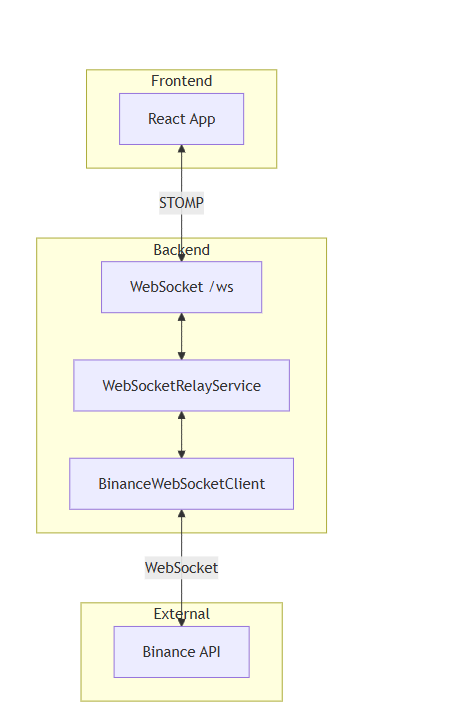

# Crypto Analysis - WebSocket Real-Time Streaming

Real-time cryptocurrency data streaming using WebSocket and STOMP protocol.

---

## 📋 Table of Contents

- [Architecture Overview](#architecture-overview)
- [API Overview](#api-overview)
- [Backend Setup](#backend-setup)
- [Frontend Integration](#frontend-integration)
- [API Reference](#api-reference)
- [Testing](#testing)

---

## 🏗️ Architecture Overview

### **System Architecture**




### **Data Flow**

```
Frontend subscribes → WebSocketController → WebSocketRelayService
    ↓
Check subscription count → Connect to Binance (if first subscriber)
    ↓
Binance sends data → Parse to DTO → Convert to Message → Broadcast to all subscribers
```

---

## 📡 API Overview

### **WebSocket Topics**

| Topic                              | Description             | Example                   |
| ---------------------------------- | ----------------------- | ------------------------- |
| `/topic/kline/{symbol}/{interval}` | Candlestick data        | `/topic/kline/btcusdt/1m` |
| `/topic/ticker/{symbol}`           | 24hr ticker stats       | `/topic/ticker/ethusdt`   |
| `/topic/ticker/all`                | All symbols mini ticker | `/topic/ticker/all`       |

### **REST Endpoints**

| Endpoint                           | Description                  |
| ---------------------------------- | ---------------------------- |
| `GET /api/websocket/subscriptions` | Get all active subscriptions |
| `GET /api/websocket/health`        | WebSocket health check       |

### **Message Formats**

**KlineMessage:**

```json
{
  "symbol": "BTCUSDT",
  "interval": "1m",
  "open": "43250.50",
  "high": "43300.00",
  "low": "43200.00",
  "close": "43280.75",
  "volume": "150.5",
  "isClosed": true
}
```

**TickerMessage:**

```json
{
  "symbol": "BTCUSDT",
  "price": "43280.75",
  "priceChange": "250.50",
  "priceChangePercent": "0.58",
  "volume": "25000.50"
}
```

---

## 🔧 Backend Setup

### **1. Run Application**

```bash
cd backend
mvn clean install
mvn spring-boot:run
```

### **2. Verify**

- **Swagger UI:** http://localhost:8080/swagger-ui.html
- **Health Check:** http://localhost:8080/api/websocket/health
- **WebSocket:** ws://localhost:8080/ws

### **Configuration**

`src/main/resources/application.yaml`:

```yaml
binance:
  websocket:
    base-url: wss://stream.binance.com:9443/ws
    reconnection-delay: 5000
    max-reconnection-attempts: 10
```

---

## 💻 Frontend Integration

### **Install Dependencies**

```bash
npm install @stomp/stompjs sockjs-client
```

### **React Example**

```javascript
import { useEffect, useState } from "react";
import { Client } from "@stomp/stompjs";
import SockJS from "sockjs-client";

function KlineChart({ symbol = "BTCUSDT", interval = "1m" }) {
  const [kline, setKline] = useState(null);

  useEffect(() => {
    const client = new Client({
      webSocketFactory: () => new SockJS("http://localhost:8080/ws"),
      onConnect: () => {
        client.subscribe(
          `/topic/kline/${symbol.toLowerCase()}/${interval}`,
          (message) => setKline(JSON.parse(message.body))
        );
      },
    });

    client.activate();
    return () => client.deactivate();
  }, [symbol, interval]);

  return <div>{kline ? `${kline.symbol}: ${kline.close}` : "Loading..."}</div>;
}
```

### **Available Intervals**

```
1m, 3m, 5m, 15m, 30m, 1h, 2h, 4h, 6h, 8h, 12h, 1d, 3d, 1w, 1M
```

---

## 🧪 Testing

### **Browser Console**

```javascript
const socket = new SockJS("http://localhost:8080/ws");
const stompClient = Stomp.over(socket);

stompClient.connect({}, () => {
  stompClient.subscribe("/topic/kline/btcusdt/1m", (msg) => {
    console.log(JSON.parse(msg.body));
  });
});
```

### **cURL**

```bash
curl http://localhost:8080/api/websocket/health
curl http://localhost:8080/api/websocket/subscriptions
```

### **Test UI (Recommended)**

A comprehensive test interface is included for testing multiple WebSocket connections:

**Location:** `src/test/resources/websocket-test.html`

**Features:**

- ✅ Multiple simultaneous connections
- ✅ Real-time stats dashboard
- ✅ Visual connection management
- ✅ Live OHLC data display

**Usage:**

1. Open `src/test/resources/websocket-test.html` in your browser
2. Click "➕ Add Connection" to create connections
3. Choose different symbols/intervals to test
4. Monitor subscriber counts and message rates

---

## 📚 API Reference

**Swagger UI:** http://localhost:8080/swagger-ui.html

**WebSocket Endpoint:** ws://localhost:8080/ws

**Supported Symbols:** Any Binance trading pair (BTCUSDT, ETHUSDT, etc.)

---

## 🚀 Quick Links

- **Swagger:** http://localhost:8080/swagger-ui.html
- **Health:** http://localhost:8080/api/websocket/health
- **Docs:** http://localhost:8080/v3/api-docs
