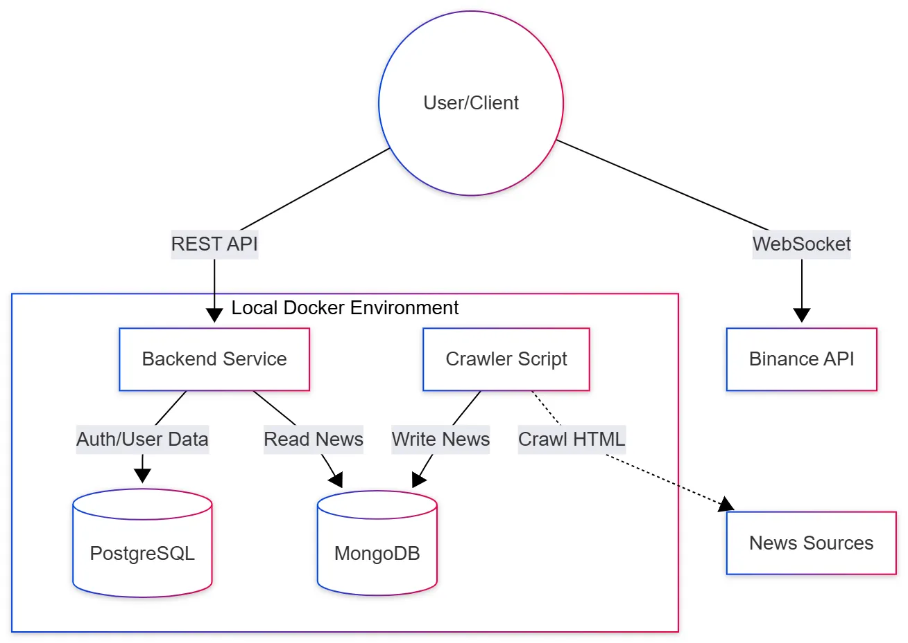
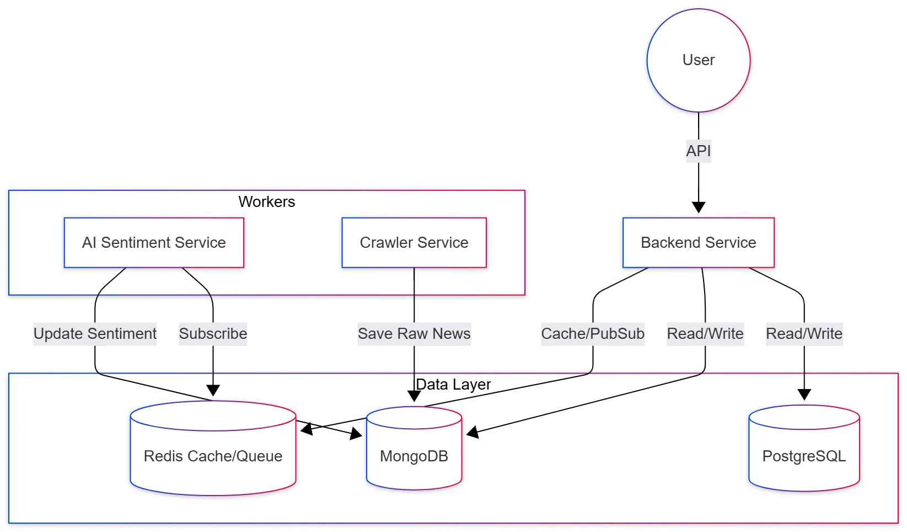
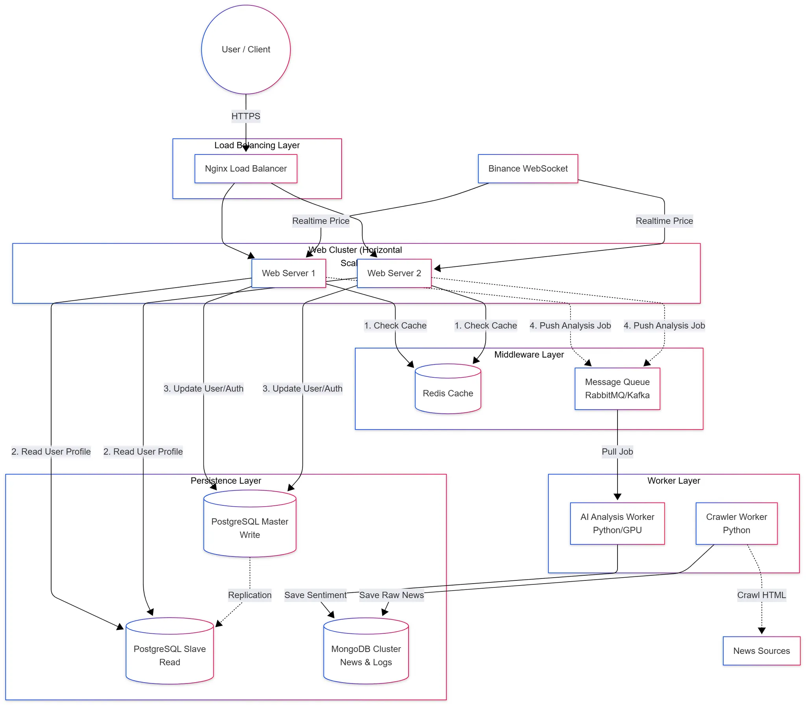

# 🏗️ Architecture Design Evolution

Tài liệu mô tả kiến trúc hệ thống Tài chính & Crypto, phát triển từ giai đoạn MVP đến khi mở rộng (Scalable).

## Giai đoạn 1: Monolithic MVP (Sprint 1 - Hiện tại)

**Mục tiêu:** Chạy được luồng dữ liệu cơ bản. Crawler lấy tin về DB, User xem được tin và biểu đồ giá.

- **Mô hình:** Tất cả code (Backend API, Crawler) chạy chung hoặc song song, kết nối trực tiếp vào Database.
- **Database:** Hybrid. PostgreSQL lưu User/Auth. MongoDB lưu Tin tức (News).

## Giai đoạn 2: Asynchronous & Caching (Sprint 2)

**Mục tiêu:** Tăng tốc độ đọc tin và xử lý AI không làm treo server.

- **Redis:** Thêm vào làm Caching (lưu tin hot) và Message Broker đơn giản.
- **AI Service:** Tách riêng, nhận lệnh từ Backend qua Redis Pub/Sub hoặc Queue.

## Giai đoạn 3: Final Architecture (Production Scale)

**Mục tiêu:** Scale độc lập từng module.

- **Load Balancer:** Phân tải request.
- **Separation:** Tách hẳn Read API và Write Worker.

