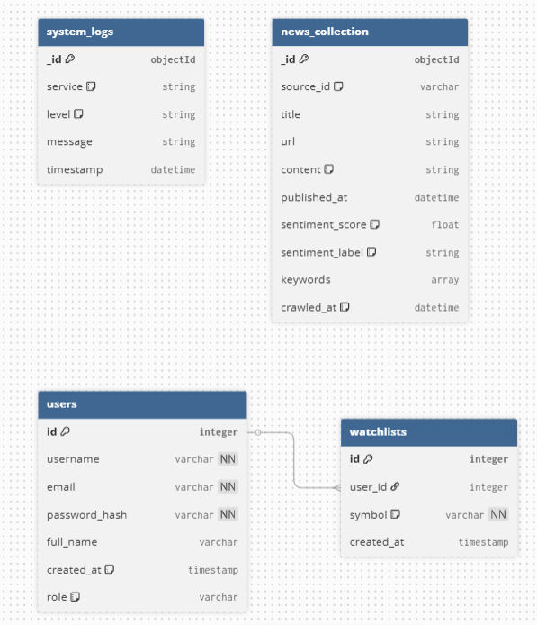

```json
// --- SQL: PostgreSQL (Quản lý User & Setting) ---
Table users {
  id integer [primary key, increment] 
  username varchar [unique, not null]
  email varchar [unique, not null]
  password_hash varchar [not null]
  full_name varchar
  created_at timestamp [default: `now()`]
  role varchar [default: 'user', note: 'user or admin']
}

Table watchlists {
  id integer [primary key, increment]
  user_id integer [ref: > users.id]
  symbol varchar [not null, note: 'BTCUSDT, ETHUSDT']
  created_at timestamp
}

// --- NoSQL: MongoDB (Quản lý Tin tức & AI Data) ---
// Lưu ý: Trong MongoDB thực tế không có schema cứng, 
// đây là cấu trúc document dự kiến.

Table news_collection {
  _id objectId [primary key]
  source_id varchar [note: 'coindesk, binance_news']
  title string
  url string [unique]
  content string [note: 'Nội dung full hoặc tóm tắt']
  published_at datetime
  
  // Phần AI Analysis (update ở Sprint 2)
  sentiment_score float [note: '-1 (Negative) to 1 (Positive)']
  sentiment_label string [note: 'Bullish, Bearish, Neutral']
  keywords array
  
  crawled_at datetime [default: `now()`]
}

Table system_logs {
  _id objectId [primary key]
  service string [note: 'crawler, backend, ai_worker']
  level string [note: 'INFO, ERROR']
  message string
  timestamp datetime
}
```